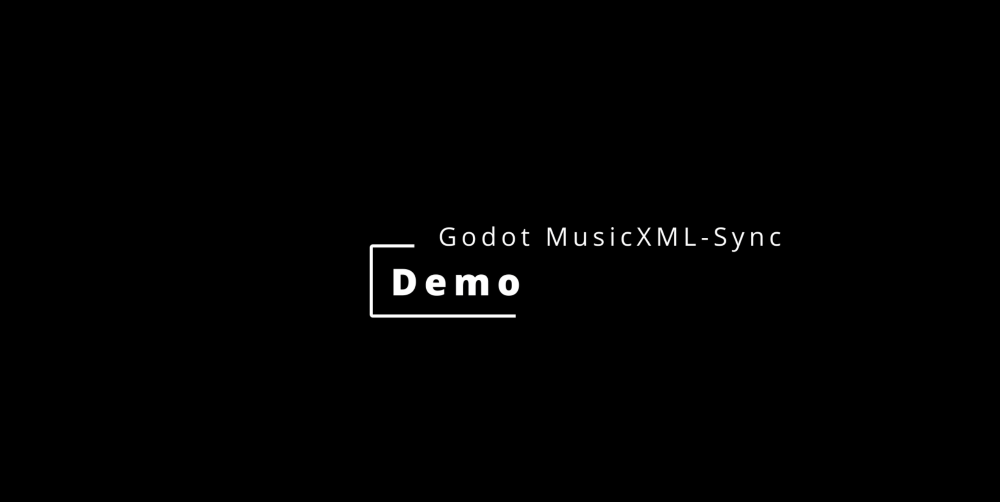

# Godot MusicXML-Sync

Godot MusicXML-Sync is a GDExtension for Godot 4 that parses MusicXML into runtime timing data and provides beat, measure, and marker events for musically aligned playback, looping, and transitions.

It is designed to keep score-level timing information such as tempo changes, measure boundaries, time signatures, and cue markers available inside Godot so log, visuals, and audio transitions can be driven by musical structure instead of raw timestamps.

## Features

- **MusicXML parsing** into a runtime `SongData` resource containing:
  - tempo map
  - measure offsets
  - beats-per-measure data
  - cue points stored by both measure and name
- **Runtime clock** (`AudioClock`) that tracks song time from active audio playback and emits:
  - `beat(beat_number)`
  - `measure(measure_number)`
  - `marker_passed(marker_name)`
  - `loop_occurred(new_time)`
- **Transition control** (`TransitionManager`) for scheduling switches at measures or named markers
- **Playback coordination** (`MusicDirector`) for:
  - queued transitions
  - immediate transitions
  - crossfade vs seamless transition styles
  - loop control
  - replay / restart behavior
  - synchronized multi-stem playback
- **Vertical layering** using `AudioStreamSynchronized` for tightly aligned stem playback with per-layer muting
- **Visual debugger UI** for:
  - current measure and beat display
  - beat flash / metronome pulse
  - upcoming cue display
  - timeline cue markers
  - loop settings
  - queued and immediate jump controls
  - transition style selection
  - song preset loading
  - dynamic layer mute controls
- **Works as a native GDExtension** (C++) for performance and editor integration

## Current Demo Capabilities

The included demo project currently supports:

- loading multiple song presets
- switching between a custom test score and a hymn demo
- jumping by cue or measure
- jumping to cue or measure
- immediate and queued transitions
- seamless and crossfaded transitions
- looping between user-defined measures
- synchronized layered stem playback with dynamic muting
- a visual timeline showing parsed cue markers

## Project Layout

- `src/` — C++ source for the GDExtension
- `api/extension_api.json` — Godot extension API file used for building bindings
- `docs/` — Internal project documentation
  - `docs/doc_classes/` — Internal class reference docs (C++)
  - `docs/images/` — UML diagrams and project images
  - `docs/markdown/`  — MD copy of all internal reference docs (C++ and GDScript)
- `project/` — Example Godot project
  - `bin/` — Built DLL + `.gdextension` file
  - `scenes/` — Demo scenes and GDScript files
  - `audio/` — Example stem audio files
  - `xml/` — Example MusicXML files


## Quick Start: Run the Demo

If the prebuilt binaries are already present, you only need Godot 4.x.

1. Open the example project in `project/`.
2. Confirm the extension files are in `res://bin/`:
   - `godot_music_xml_sync.gdextension`
   - `godot_music_xml_sync.windows.template_debug.x86_64.dll`
3. Open the main demo scene and run the project.
4. Use the debugger UI to:
   - play / pause / restart
   - enable or disable looping
   - select transition style
   - queue or trigger jumps
   - switch songs
   - mute individual layers

## Building from Source (Windows)

Prereqs:
- Python 3.x
- SCons
- A C++ toolchain (MSVC recommended)
- Godot 4.x `extension_api.json`


**Note:**
*This project was developed and tested with **Godot 4.6.rc2.mono**. The included
`api/extension_api.json` matches the version used during development.*

*If you are using a different Godot 4.x version, especially a newer stable release,
you may not need this exact file. However, if you encounter build or binding issues,
regenerating or replacing `api/extension_api.json` for your local Godot version may be necessary.*

Build debug:
```powershell
py -m scons platform=windows target=template_debug custom_api_file=api/extension_api.json
```

Build release:
```powershell
py -m scons platform=windows target=template_release custom_api_file=api/extension_api.json
```

The compiled library is output to `project/bin/`.

**Note:**
The Godot scenes and GDScript files are already included in the project. Building from source only applies to the native GDExtension in `src/`.

## Using in Godot

1. Open the example project in `project/`.

2. Make sure `godot_music_xml_sync.gdextension` points to the correct library path(s), for example:
   ```ini
   [configuration]
   entry_symbol = "godot_music_xml_sync_library_init"
   reloadable = true

   [libraries]
   windows.editor.x86_64 = "res://bin/godot_music_xml_sync.windows.template_debug.x86_64.dll"
   windows.debug.x86_64  = "res://bin/godot_music_xml_sync.windows.template_debug.x86_64.dll"
   ```

3. Load a MusicXML file and its corresponding audio stems through the `MusicDirector`.

4. Use `SongData` through the `AudioClock` and `TransitionManager` to drive:
   - beat and measure synced logic
   - loop behavior
   - marker-based transitions
   - layered playback changes

## Main Runtime Classes

### `MusicXMLParser`
Parses a `.musicxml` file and produces a runtime `SongData` resource.

Responsibilities:
- read tempo changes
- read time signatures
- read cue markers / rehearsal text
- compute measure offsets
- store beats per measure
- smooth tempo ramps such as accelerando and ritardando

### `SongData`
A Godot `Resource` containing parsed musical timing data.

Stores:
- BPM map
- measure offsets
- beats per measure
- cues by measure
- cues by name

Note:
- cue measure indices are stored internally as **0-based**
- UI display and public jump inputs use **1-based** measure numbering

### `AudioClock`
Tracks live playback time and emits musically meaningful signals.

Responsibilities:
- sync to audio playback position
- emit beat / measure / marker signals
- support loop boundaries
- stop cleanly at song end
- expose current playback state to the debugger

### `TransitionManager`
Handles queued transition triggering logic.

Responsibilities:
- queue transitions at a target measure
- queue transitions at a target cue marker
- emit `transition_triggered` when the clock reaches the correct point

### `MusicDirector`
Coordinates playback, transitions, stem grouping, and loop behavior.

Responsibilities:
- load song data and stems
- start / pause / resume / restart playback
- request queued and immediate transitions
- resolve cue destinations to measure locations
- apply transition style defaults
- manage synchronized stem playback and muting

### `VisualDebugger`
Provides the in-engine testing and debugging UI.

Responsibilities:
- show current measure / beat
- show upcoming cue
- display timeline cue markers
- expose transition controls
- expose loop and transport controls
- expose song selection
- dynamically build mute controls based on layer count

### `main.gd`
Scene-level glue code for the demo project.

Responsibilities:
- define song presets
- load MusicXML and stem bundles
- connect `VisualDebugger` UI signals
- route requests into `MusicDirector`

## Demo Controls

The included debugger currently exposes:

- **Play / Pause / Restart**
- **Loop controls**
  - enabled/disabled
  - start measure
  - end measure
- **Transition style**
  - Crossfade
  - Seamless
- **Queued jump controls**
  - trigger by cue or measure
  - destination by cue or measure
- **Immediate jump controls**
  - destination by cue or measure
- **Song preset selection**
- **Dynamic layer mute toggles**

### Demo Video
[](https://youtu.be/-2Asy_uxBqI)
[Demo](https://youtu.be/-2Asy_uxBqI)

## Additional Resources

### Documentation
 - [Markdown Docs](./docs/markdown/godotmusicxmlsync_md_docs.md)
 - [Architecture Diagram](./docs/images/class-diagram.png)

### Music
- **Scores:**
  - [Test Score](./docs/images/scores/test_score/)
  - [Hymn Demo Score](./docs/images/scores/hymn/)
- **Audio:**
  - [Test Music Stems](./project/audio/test_music/)
  - [Hymn Demo Stems](./project/audio/hymns/)

## Known Limitations

- The parser currently targets uncompressed `.musicxml` input only
- Compound meter handling is limited and assumes quarter-note pulse timing for current demos
- Latency compensation using low-level `AudioServer` timing has not been implemented
- Cue destinations with repeated cue names currently resolve by directional nearest-occurrence logic rather than exposing full occurrence indexing
- Transitions currently target the start of a measure only
- Arbitrary beat-level or subdivision-level jump targets within a measure are not yet supported
- Layered playback requires separate audio files for each layer. This may require extra setup in notation software such as MuseScore, where each layer usually needs to be written as its own `part` for clean stem export.

## Future Work

Potential future extensions include:

- advanced latency compensation using `AudioServer`
- richer compound meter support
- saved `.tres` export of parsed `SongData`
- richer cue occurrence targeting
- more polished editor tooling around song import and preset creation

## License

MPL-2.0
